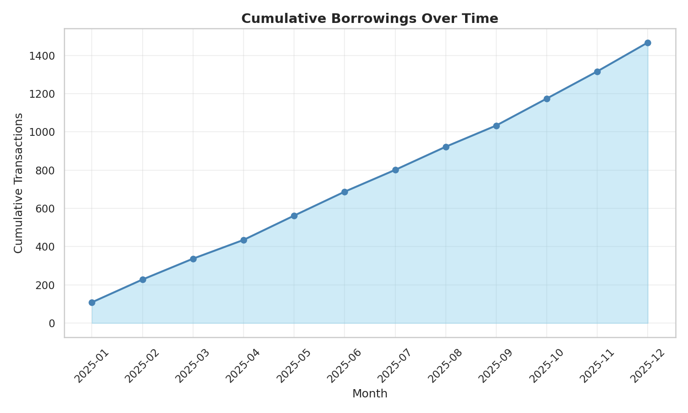
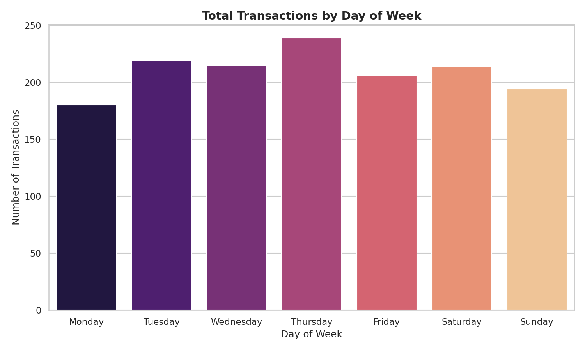
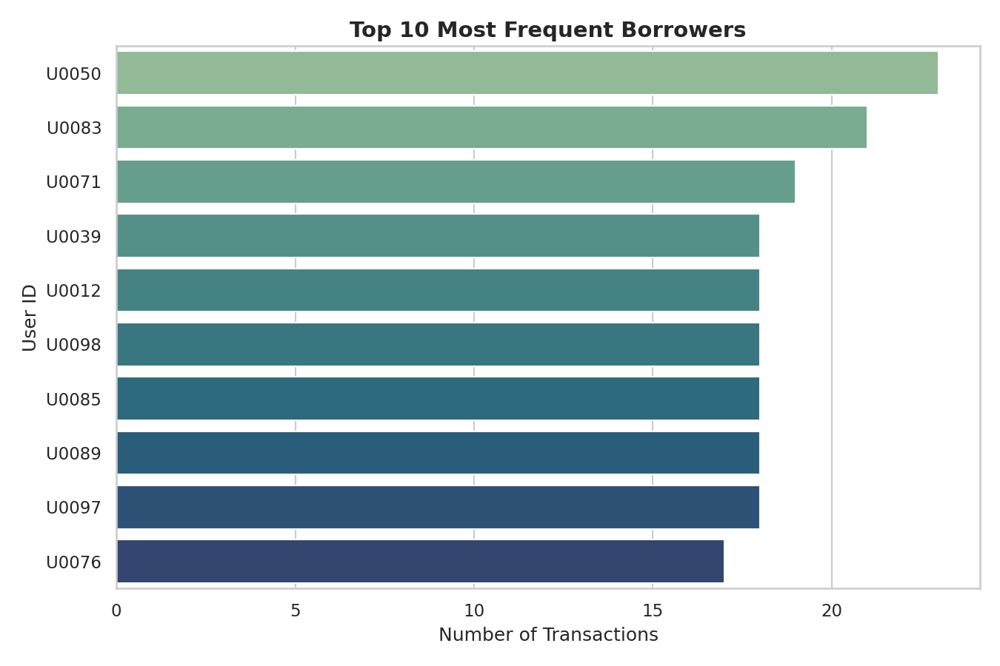
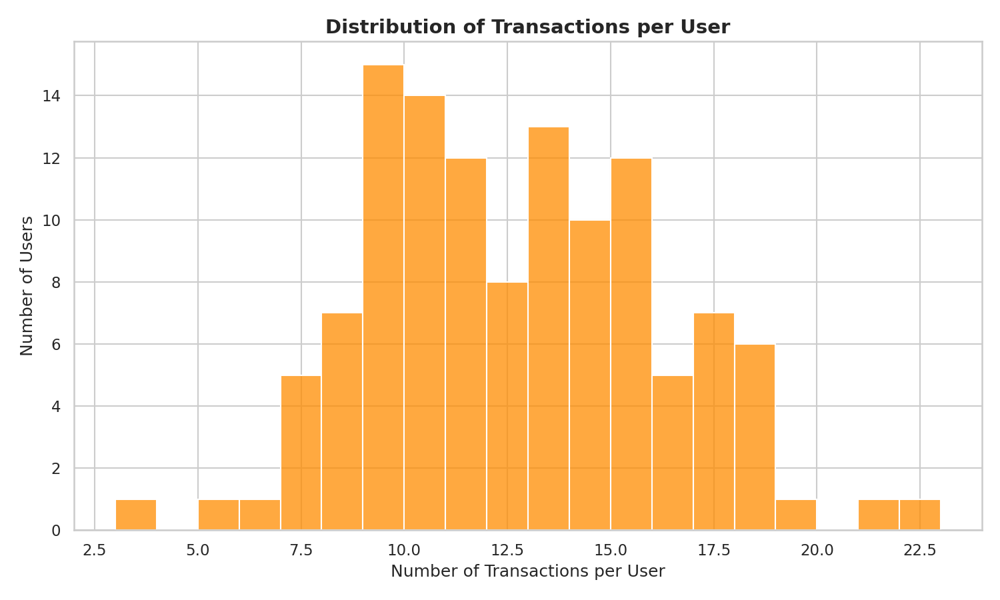
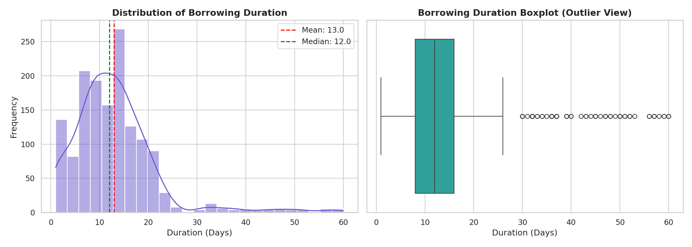
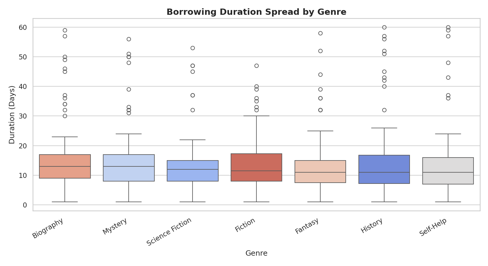
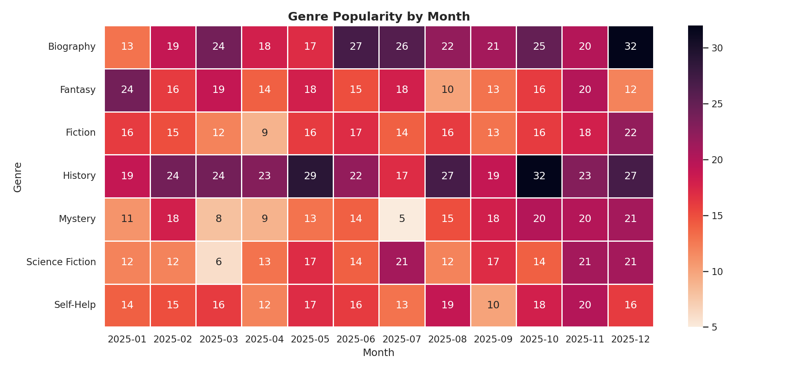
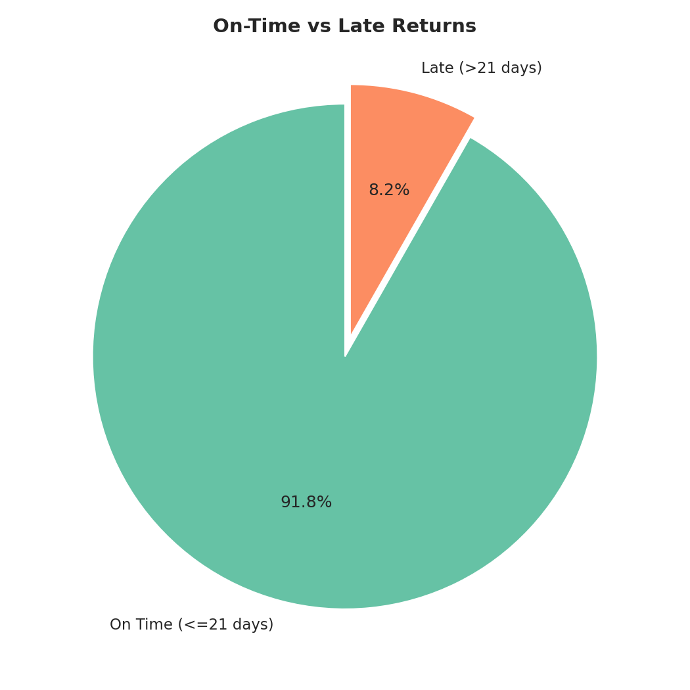

<div align="center">

# -- ! E-Library Data Insights ! --
### *Interactive Data Analysis & Visualization Dashboard for Library Transaction Records*

[](https://www.python.org/)
[](https://pandas.pydata.org/)
[](https://matplotlib.org/)
[](https://jupyter.org/)

<br/>

> *"Data is the new library — and every transaction tells a story worth reading."*

</div>

---

## 📋 Table of Contents

- [📌 Overview](#-overview)
- [🎯 Problem Statement](#-problem-statement)
- [✨ Key Features](#-key-features)
- [🏗️ Project Structure](#️-project-structure)
- [🔄 Project Workflow](#-project-workflow)
- [📊 Part A — Transaction & Usage Analysis](#-part-a--transaction--usage-analysis)
- [📚 Part B — Genre & Borrowing Behavior](#-part-b--genre--borrowing-behavior)
- [⚠️ Part C — Late Returns & Compliance](#️-part-c--late-returns--compliance)
- [📈 Key Findings](#-key-findings)
- [🛠️ Tech Stack](#️-tech-stack)
- [🏆 Advantages](#-advantages)
- [📄 License](#-license)
- [👤 Author](#-author)
- [🙏 Acknowledgements](#-acknowledgements)

---

## 📌 Overview

The **E-Library Data Insights** project is a comprehensive data analysis and visualization pipeline built on real-world library transaction records. It explores borrowing patterns, user engagement, genre popularity, and return compliance using Python's data science ecosystem — all presented through a clean, chart-rich Jupyter Notebook dashboard.

This project is designed to:
- Analyse 1,467 library transactions across 120 users and 35 unique books
- Identify peak borrowing days, top users, and most popular genres
- Study borrowing duration distributions and detect late-return patterns
- Present all insights through 8 distinct, professional-grade visualizations

---

## 🎯 Problem Statement

> **Objective:** Perform end-to-end exploratory data analysis on an e-library's transaction dataset and surface actionable insights through visualizations.

You are analysing a year's worth of library borrowing data. The system must process raw CSV records, clean and enrich the data, and produce a suite of charts that reveal how users interact with the library — from their preferred genres and reading durations, to which days they borrow most and whether they return books on time.

| 📂 Analysis Area | 📄 Type | 🔍 Description |
|-----------------|---------|----------------|
| Transaction Volume | Time Series | Cumulative borrowings plotted month-over-month |
| Day-of-Week Activity | Bar Chart | Total transactions broken down by weekday |
| Top Borrowers | Horizontal Bar | Most active users by transaction count |
| User Activity Distribution | Histogram | How transactions are spread across all 120 users |
| Borrowing Duration | Histogram + Boxplot | Distribution of borrow lengths with mean/median markers |
| Duration by Genre | Box Plot | Per-genre spread and outlier analysis |
| Genre × Month Heatmap | Heatmap | Monthly popularity trends across all 7 genres |
| Late Return Breakdown | Pie Chart | On-time vs late (>21 days) return proportion |

---

## ✨ Key Features

| Feature | Description |
|--------|-------------|
| 📂 **CSV Ingestion** | Reads and validates raw `library_transactions.csv` with 1,467 records |
| 🧹 **Data Cleaning** | Filters invalid rows, parses dates, and derives duration fields |
| 📅 **Temporal Analysis** | Month-over-month and day-of-week breakdowns of borrowing activity |
| 📊 **8 Visualizations** | Bar, histogram, boxplot, heatmap, and pie charts covering all key dimensions |
| 🔍 **Outlier Detection** | Boxplots surface extreme borrowing durations up to 60 days |
| 🏅 **Top-N Ranking** | Identifies top 5 books and top 10 borrowers by transaction count |
| ⚠️ **Late Return Flagging** | Classifies returns exceeding 21 days and computes non-compliance rate |
| 📄 **Auto Summary Report** | Exports a plain-text `summary_report.txt` with all key statistics |

---

## 🏗️ Project Structure

```
📦 e-library-data-insights/
│
├── 📓 library_dashboard.ipynb        ← Main Jupyter Notebook (analysis + charts)
│
├── 📄 library_transactions.csv       ← Raw transaction dataset (input)
│
├── 📄 summary_report.txt             ← Auto-generated key statistics report
│
├── 🖼️ busiest_days_bar_chart.png     ← Transactions by day of week
├── 🖼️ cumulative_trend.png           ← Cumulative borrowings over time
├── 🖼️ duration_by_genre_boxplot.png  ← Borrow duration spread per genre
├── 🖼️ duration_distribution.png      ← Overall duration histogram + boxplot
├── 🖼️ genre_month_heatmap.png        ← Genre popularity by month
├── 🖼️ late_return_breakdown.png      ← On-time vs late returns pie chart
├── 🖼️ top_borrowers_bar_chart.png    ← Top 10 most frequent borrowers
├── 🖼️ user_activity_distribution.png ← Transactions per user histogram
│
└── 📄 README.md                      ← Project documentation
```

---

## 🔄 Project Workflow

```
CSV Input (library_transactions.csv)
             │
             ▼
┌────────────────────────────┐
│   Data Loading & Cleaning  │  ← Parse dates, drop nulls, derive duration
└────────────┬───────────────┘
             │
     ┌───────┴──────────┐
     ▼                  ▼
┌──────────┐     ┌─────────────────┐
│  Summary │     │   Visualization │
│  Stats   │     │    Engine       │
└────┬─────┘     └────────┬────────┘
     │                    │
     ▼                    ▼
┌──────────────┐   ┌──────────────────────────┐
│summary_report│   │ 8 Chart PNGs Exported    │
│   .txt       │   │ (bar, box, heat, pie ...) │
└──────────────┘   └──────────────────────────┘
             │
             ▼
   Jupyter Notebook Dashboard ✅
```

---

## 📊 Part A — Transaction & Usage Analysis

### 1. Cumulative Borrowings Over Time

> Tracks how total library transactions accumulated month-by-month throughout 2025.



The library saw **steady, near-linear growth** all year — starting at ~110 transactions in January and reaching 1,467 by December. No significant seasonal dips were observed, indicating consistent user engagement year-round.

---

### 2. Total Transactions by Day of Week

> Reveals which weekdays see the highest borrowing activity.



**Thursday is the busiest day** with ~238 transactions, while Monday records the fewest (~180). Mid-week (Tue–Thu) consistently outperforms the weekend, suggesting a weekday-oriented user base.

| Day | Approx. Transactions |
|-----|---------------------|
| 🏆 Thursday | ~238 |
| Tuesday | ~218 |
| Wednesday | ~215 |
| Saturday | ~214 |
| Friday | ~206 |
| Sunday | ~195 |
| Monday | ~180 |

---

### 3. Top 10 Most Frequent Borrowers

> Ranks users by total number of borrowing transactions.



**U0050 leads with 23 transactions**, followed by U0083 (21) and U0071 (19). Six users are tied at 18 transactions, showing a competitive mid-tier cluster of highly active readers.

---

### 4. Distribution of Transactions per User

> Shows how borrowing activity is spread across all 120 users.



The distribution is **roughly bell-shaped**, peaking at 9–10 transactions per user. Most users borrow between 8 and 15 times, with a small tail of power users exceeding 20 transactions — confirming a healthy core base with standout super-readers.

---

## 📚 Part B — Genre & Borrowing Behavior

### 5. Distribution of Borrowing Duration

> Analyses how long users keep books, with mean and median reference lines.



Borrowing durations are **right-skewed**, with the bulk of loans falling between 5–20 days. The mean (13.0 days) sits slightly above the median (12.0 days), pulled up by a tail of extended borrows reaching up to 60 days. The IQR spans 8–16 days.

| Statistic | Value |
|-----------|-------|
| Average | 12.96 days |
| Median | 12.00 days |
| Std Dev | 8.66 days |
| Min / Max | 1 / 60 days |
| 25th / 75th Percentile | 8 / 16 days |

---

### 6. Borrowing Duration Spread by Genre

> Compares loan length distributions across all 7 genres using box plots.



**Mystery and Biography** have the highest average durations (~13.8 and 13.6 days respectively), while **Fantasy and Self-Help** are returned fastest (~12.1 and 12.5 days). All genres share a similar IQR but vary in outlier frequency — Fiction and Biography show the widest spread of extreme borrows.

---

### 7. Genre Popularity by Month

> A heatmap showing how each genre's borrowing count varies across every month of 2025.



**History dominates year-round**, peaking in October (32 borrows). **Biography** surges in December (32) and June (27). Mystery dips sharply in July (only 5 borrows) before recovering. Science Fiction and Fantasy show moderate, consistent activity with occasional spikes.

---

## ⚠️ Part C — Late Returns & Compliance

### 8. On-Time vs Late Returns

> Classifies all transactions as on-time (≤21 days) or late (>21 days).



**91.8% of all books are returned on time.** Only 121 transactions (8.25%) exceeded the 21-day threshold, reflecting strong overall compliance. This low late-return rate suggests users are generally responsible borrowers, though targeted reminders could push compliance even higher.

---

## 📈 Key Findings

| # | Insight |
|---|---------|
| 📖 | **Most Borrowed Book:** *Rising: A Memoir* with 87 borrows |
| 🏷️ | **Most Popular Genre:** History — consistent demand all year |
| 📅 | **Busiest Day:** Thursday (~238 transactions) |
| 👤 | **Top Borrower:** U0050 with 23 transactions |
| ⏱️ | **Avg Loan Duration:** 12.96 days (Median: 12 days) |
| ⚠️ | **Late Returns:** 121 (8.25%) exceeded the 21-day limit |
| 📈 | **Growth:** Linear cumulative trend with no seasonal dip |
| 🔍 | **Extreme Loans:** Some borrows stretched to 60 days (max) |

---

## 🛠️ Tech Stack

| Tool | Version | Purpose |
|------|---------|---------|
| 🐍 **Python** | 3.8+ | Core programming language |
| 🐼 **Pandas** | Latest | Data ingestion, cleaning, and aggregation |
| 📊 **Matplotlib** | Latest | All chart rendering and export |
| 🌊 **Seaborn** | Latest | Statistical plot styling (boxplots, heatmap) |
| 📓 **Jupyter Notebook** | Latest | Interactive analysis environment |
| 📄 **CSV / TXT** | — | Input data and plain-text report output |

---

## 🏆 Advantages

| Advantage | Detail |
|-----------|--------|
| 🎓 **Comprehensive Coverage** | 8 chart types cover time, user, genre, and compliance dimensions |
| 🔄 **Reproducible Pipeline** | Single notebook runs end-to-end from raw CSV to all outputs |
| 📚 **Genre Intelligence** | Heatmap reveals monthly trends invisible in simple aggregates |
| 🖥️ **Portable** | No database needed — runs entirely on a CSV file |
| ⚡ **Lightweight** | Pure Python data science stack, no web framework required |
| 🧪 **Extensible** | Easy to add new charts, filters, or time periods |
| 📖 **Auto Reporting** | Summary stats written to `summary_report.txt` automatically |
| 🛡️ **Clean Data Handling** | Invalid records filtered before analysis to ensure accuracy |

---

## 📄 License

This project is licensed under the **MIT License** — see the [LICENSE](LICENSE) file for full details.

```
MIT License — Free to use, modify, and distribute with attribution.
```

---

## 👤 Author

<div align="center">

### Gangani Krishna

[](https://github.com/)

> *"Every borrow, every return, every late slip — together they paint a portrait of a reading community."*

**🎓 Role:** Data Analyst | Python Developer \
**📍 Location:** India\
**🛠️ Skills:** Python · Pandas · Matplotlib · Seaborn · Jupyter · Data Visualization · EDA

</div>

---

## 🙏 Acknowledgements

Special thanks to the following resources and communities that made this project possible:

- 📚 [Pandas Documentation](https://pandas.pydata.org/docs/) — Official Pandas reference
- 📊 [Matplotlib Docs](https://matplotlib.org/stable/contents.html) — Chart configuration and export
- 🌊 [Seaborn Docs](https://seaborn.pydata.org/) — Statistical visualization library
- 📓 [Jupyter Project](https://jupyter.org/) — Interactive notebook environment
- 🔍 [Real Python — EDA Guide](https://realpython.com/pandas-python-explore-dataset/) — Exploratory data analysis tutorials
- 💬 [Stack Overflow Community](https://stackoverflow.com/) — Problem-solving support
- 📖 [Kaggle Learn](https://www.kaggle.com/learn) — Data analysis and visualization courses

---

<div align="center">

---

*Made with ❤️ and ☕ — Last updated: 18 July, 2026*

</div>