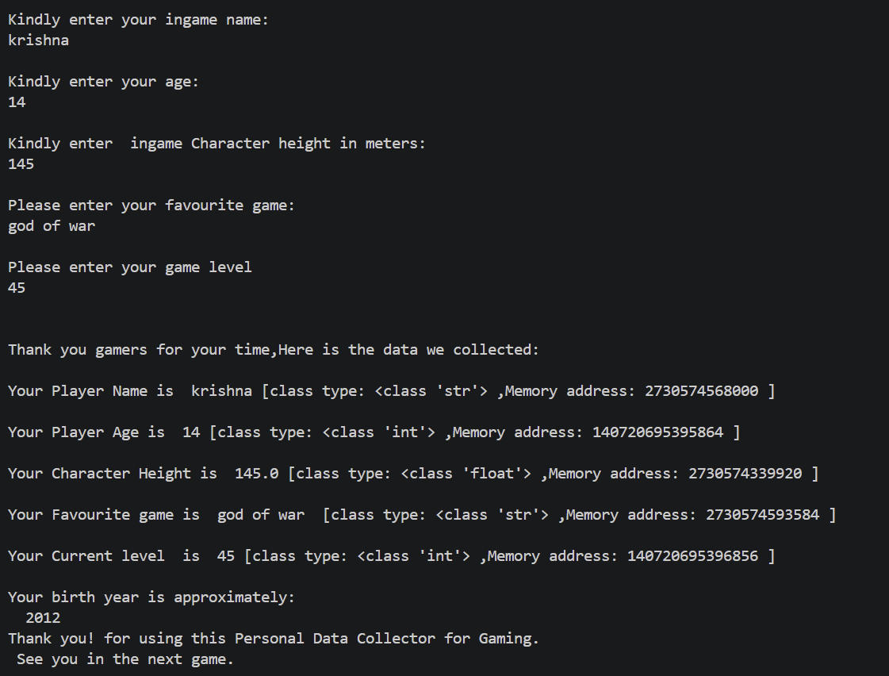

# World of Games - Personal Data Collector

## Overview
This Python project is a simple interactive console application that collects gaming-related personal information from the user and displays it back with additional details such as data types, memory addresses, and estimated birth year.

The program is beginner-friendly and demonstrates:
- User input handling
- Data types in Python
- Variable memory references
- Basic calculations
- Using the `datetime` module

---

## Features
- Collects:
  - Player Name
  - Player Age
  - Character Height
  - Favourite Game
  - Current Game Level
- Displays:
  - Entered information
  - Variable data types
  - Memory addresses using `id()`
- Calculates approximate birth year
- Friendly gaming-themed interface

---

## Technologies Used
- Python 3
- Built-in `datetime` module

---

## Project Structure
```bash
python_project_1.py
README.md
```

---

## How to Run

### Step 1: Install Python
Make sure Python 3 is installed on your system.

Check version:
```bash
python --version
```

### Step 2: Run the Program
Open terminal or command prompt and run:

```bash
python python_project_1.py
```

---

## Example Output


```

---

## Concepts Demonstrated
- `input()`
- Type conversion:
  - `int()`
  - `float()`
- `type()`
- `id()`
- String formatting
- Date and time handling with `datetime`

---

## Future Improvements
- Add input validation
- Store player data in a file
- Add graphical interface
- Add multiple player support
- Create score tracking system

---

## Author
Created as a beginner Python practice project for learning user input and data handling.

---

## License
This project is free to use for educational purposes.
