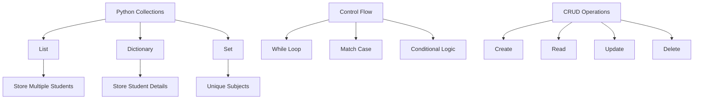

<div align="center">

# 🎓 Collection Manipulator — Student Database Management System

### *Interactive Python CLI for Managing Student Records with Collection Operations*

[](https://www.python.org/)
[](https://www.python.org/)
[](https://www.python.org/)
[](https://www.python.org/)
[](https://www.python.org/)

<br/>

> *"Good data management begins with well-structured collections."*

</div>

---

# 📚 Table of Contents

- [📌 Overview](#-overview)
- [🎯 Problem Statement](#-problem-statement)
- [✨ Features](#-features)
- [🧠 Concepts Used](#-concepts-used)
- [🏗️ Project Structure](#️-project-structure)
- [⚙️ System Workflow](#️-system-workflow)
- [🗃️ Database Operations](#️-database-operations)
- [🛠️ Technologies Used](#️-technologies-used)
- [📈 Program Highlights](#-program-highlights)
- [🚀 Future Improvements](#-future-improvements)
- [🏆 Advantages](#-advantages)
- [📄 License](#-license)
- [👤 Author](#-author)
- [🙏 Acknowledgements](#-acknowledgements)

---

# 📌 Overview

The **Collection Manipulator — Student Database Management System** is a menu-driven Python console application that demonstrates how to manage collections using **lists**, **dictionaries**, **sets**, loops, and conditional logic.

The program allows users to:

- ➕ Add students to a database
- 📋 Display all student records
- 🔍 Search students by ID
- ✏️ Update student information
- ❌ Delete individual students
- 🧹 Clear the entire database
- 📚 Display all unique subjects offered

This project is ideal for beginners learning:
- Python collections
- CRUD operations
- Menu-driven programs
- Data organization
- Console application development

---

# 🎯 Problem Statement

> **Objective:** Build an interactive student database system using Python collection data structures.

A school administration system requires a simple console-based application to manage student information efficiently. The application should store and manipulate student records dynamically using Python collections.

The system must support:

| Feature | Description |
|---------|-------------|
| ➕ Add Student | Store student details inside a database |
| 📋 Display Records | View all students currently stored |
| 🔍 Search Student | Find students using their ID |
| ✏️ Update Student | Modify existing student details |
| ❌ Delete Student | Remove a student record |
| 📚 Subject Viewer | Display unique subjects offered |
| 🧹 Clear Database | Delete all student records |
| 🚪 Exit Program | Safely terminate the application |

---

# ✨ Features

| Feature | Description |
|---------|-------------|
| 📂 **List-Based Database** | Uses Python lists to store multiple student dictionaries |
| 🧾 **Dictionary Records** | Each student is represented as a dictionary |
| 🔁 **Infinite Menu Loop** | Program keeps running until Exit is selected |
| 🔍 **Search by ID** | Quickly find students using list comprehension |
| ✏️ **Update Functionality** | Edit student age, grade, subject, and DOB |
| ❌ **Delete Records** | Remove selected students from the database |
| 📚 **Unique Subject Display** | Uses Python sets to avoid duplicate subjects |
| 🧹 **Database Reset** | Clears all records instantly |
| ⚡ **Match-Case Syntax** | Uses modern Python pattern matching |
| 🖥️ **Interactive CLI** | User-friendly console navigation |

---

# 🧠 Concepts Used

<div align="center">



</div>

---

# 🏗️ Project Structure

```bash
📦 collection-manipulator/
│
├── 📄 collection_manipulator.py    ← Main application
│
└── 📄 README.md                    ← Project documentation
```

---

# ⚙️ System Workflow

```text
Program Start
      │
      ▼
┌───────────────────────────┐
│ Display Main Menu         │
└────────────┬──────────────┘
             │
             ▼
 ┌─────────────────────────┐
 │ User Selects Operation  │
 └────────────┬────────────┘
              │
     ┌────────┼────────┐
     ▼        ▼        ▼
  Add      Search    Update
 Student   Student   Record
     │        │        │
     ▼        ▼        ▼
 Database Manipulation Logic
              │
              ▼
      Display Result
              │
              ▼
      Return to Menu
              │
        Exit Option
```

---

# 🗃️ Database Operations

## ➕ 1. Add Student

The program collects:
- Name
- Student ID
- Age
- Grade
- Subject
- Date of Birth

### Example Student Record

```python
student = {
    "name": "Krishna",
    "id": 101,
    "age": 18,
    "grade": "A",
    "subject": "Python",
    "dob": "01/01/2008"
}
```

The record is appended to the database list:

```python
database.append(student)
```

---

## 📋 2. Display All Students

Displays all records currently stored in the database.

### Example Output

```text
Name: Krishna
ID: 101
Age: 18
Grade: A
Subject: Python
DOB: 01/01/2008
```

---

## 🔍 3. Search Student by ID

Uses list comprehension to search efficiently:

```python
found_students = [
    student for student in database
    if student['id'] == search_id
]
```

### Benefits
- Cleaner syntax
- Faster filtering
- Beginner-friendly implementation

---

## ✏️ 4. Update Student Information

Allows modification of:
- Age
- Grade
- Subject
- DOB

### Workflow

```text
Search Student ID
        │
        ▼
Student Found?
   │         │
 Yes         No
   │          │
Update     Display Error
Details
```

---

## ❌ 5. Delete Student

The selected student record is removed using:

```python
database.remove(student)
```

---

## 📚 6. Display Subjects Offered

Uses Python sets to eliminate duplicates:

```python
subjects = set(student['subject'] for student in database)
```

### Example Output

```text
Python
Mathematics
Science
English
```

---

## 🧹 7. Delete All Students

Clears the entire database instantly:

```python
database.clear()
```

---

# 🛠️ Technologies Used

| Technology | Purpose |
|------------|---------|
| 🐍 Python 3.10+ | Core programming language |
| 📂 Lists | Store multiple student records |
| 🧾 Dictionaries | Store structured student data |
| 📚 Sets | Store unique subjects |
| 🔁 While Loop | Infinite menu system |
| 🎯 Match-Case | Menu option handling |
| 🖥️ CLI Interface | User interaction |
| ⚡ List Comprehension | Student search filtering |

---

# 📈 Program Highlights

<div align="center">

| Module | Status |
|--------|--------|
| ➕ Add Student | ✅ Working |
| 📋 Display Students | ✅ Working |
| 🔍 Search Student | ✅ Working |
| ✏️ Update Student | ✅ Working |
| ❌ Delete Student | ✅ Working |
| 📚 Display Subjects | ✅ Working |
| 🧹 Clear Database | ✅ Working |
| 🚪 Exit System | ✅ Working |

</div>

---

# 🚀 Future Improvements

| Improvement | Description |
|------------|-------------|
| 💾 File Storage | Save records permanently using JSON/CSV |
| 🔐 Authentication | Add login system |
| 🖥️ GUI Version | Build using Tkinter or PyQt |
| 🌐 Web Version | Convert into Flask/Django app |
| 📊 Analytics | Generate student statistics |
| 🔎 Advanced Search | Search by grade or subject |
| 🗄️ SQL Database | Integrate MySQL/PostgreSQL |

---

# 🏆 Advantages

| Advantage | Detail |
|-----------|--------|
| 🎓 Beginner Friendly | Great for learning Python collections |
| 🧠 Strengthens Logic | Reinforces CRUD concepts |
| ⚡ Lightweight | No external dependencies required |
| 📚 Educational | Covers lists, dictionaries, sets, loops |
| 🔄 Reusable Structure | Can be expanded into larger systems |
| 🖥️ Real-World Simulation | Mimics actual database management |
| 📖 Clean Code Flow | Easy-to-understand menu navigation |

---

# 📄 License

This project is licensed under the **MIT License**.

```text
MIT License — Free to use, modify, and distribute with attribution.
```

---

# 👤 Author

<div align="center">

## Gangani Krishna

[](https://www.python.org/)
[](https://github.com/)
[](https://www.python.org/)

> *"Data becomes powerful when collections organize it intelligently."*

</div>

---

# 🙏 Acknowledgements

Special thanks to these amazing resources and communities:

- 📘 Python Official Documentation
- 💻 Real Python
- 📚 W3Schools Python Tutorials
- 🧠 Stack Overflow Community
- 🎓 Beginner Python Learning Communities
- 🚀 Open Source Developers

---

<div align="center">

## ⭐ If you like this project, consider giving it a star!

### Made with ❤️ using Python Collections

**Last Updated:** 27 May 2026

</div>
