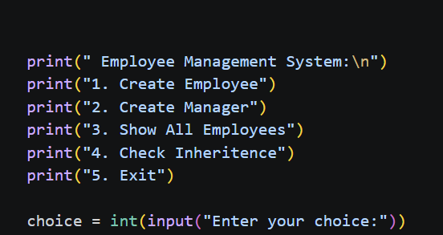

<div align="center">

# 👨‍💼 Employee Management System

### *A Menu-Driven Python Application Demonstrating Object-Oriented Programming (OOP) Concepts*

[](https://www.python.org/)
[](https://docs.python.org/3/tutorial/classes.html)
[](https://docs.python.org/3/tutorial/classes.html)
[](https://www.python.org/)

<br/>

> *"Object-Oriented Programming allows software to model real-world entities efficiently."*

</div>

---

# 📋 Table of Contents

- 📌 Overview
- 🎯 Objective
- ✨ Features
- 🧠 OOP Concepts Demonstrated
- 🏗️ Project Structure
- 🔄 Workflow
- 🧩 Class Diagram
- 📚 Employee Class
- 👨‍💼 Manager Class
- 📖 Program Menu
- 🛠️ Technologies Used
- 📈 Sample Output
- 🚀 Future Enhancements
- 🏆 Advantages
- 📄 License
- 👤 Author
- 🙏 Acknowledgements

---

# 📌 Overview

The **Employee Management System** is a console-based Python application developed to demonstrate the fundamentals of **Object-Oriented Programming (OOP)**.

The application allows users to create and manage **Employee** and **Manager** objects while showcasing concepts like:

- Classes & Objects
- Constructors
- Encapsulation
- Inheritance
- Method Overriding
- Getter & Setter Methods
- Dictionary-based Object Storage
- Menu-driven Programming

---

# 🎯 Objective

Build an Employee Management System capable of storing employee information while implementing major OOP principles.

The program allows users to:

| Feature | Description |
|---------|-------------|
| 👤 Create Employee | Add new employee records |
| 👨‍💼 Create Manager | Add manager records using inheritance |
| 📋 Display Employees | View all stored employees |
| 🧬 Check Inheritance | Verify inheritance using `issubclass()` |
| 🚪 Exit | Close the application |

---

# ✨ Features

| Feature | Description |
|---------|-------------|
| 👤 Employee Creation | Create Employee objects |
| 👨‍💼 Manager Creation | Manager inherits Employee |
| 🔒 Encapsulation | Salary and Employee ID are private |
| 🔑 Getter & Setter Methods | Controlled access to private data |
| 🧬 Inheritance | Manager class extends Employee |
| 🔄 Method Overriding | Customized display() method |
| 📂 Dictionary Storage | Employee objects stored dynamically |
| 🖥️ Interactive Menu | Easy-to-use console interface |
| 🎯 Match-Case | Python pattern matching |

---

# 🧠 OOP Concepts Demonstrated

| Concept | Description |
|----------|-------------|
| 🏛️ Class | Employee and Manager |
| 📦 Object | Employee & Manager instances |
| 🔧 Constructor | `__init__()` |
| 🔒 Encapsulation | Private salary and employee ID |
| 🔑 Getter/Setter | Controlled access to private members |
| 🧬 Inheritance | Manager inherits Employee |
| 🔄 Method Overriding | `display()` |
| 🎭 Polymorphism | Same method behaves differently |

---

# 🏗️ Project Structure

```text
📦 employee-management-system/
│
├── employee_management.py
│
└── README.md
```

---

# 🔄 Workflow

```text
                Start
                  │
                  ▼
        Display Main Menu
                  │
      ┌───────────┼────────────┐
      ▼           ▼            ▼
 Create      Create       Show Employees
 Employee     Manager
      │           │
      ▼           ▼
 Create Object  Create Object
      │           │
      └──────┬────┘
             ▼
 Store Object in Dictionary
             │
             ▼
 Display Employee Details
             │
             ▼
     Check Inheritance
             │
             ▼
            Exit
```

---

# 🧩 Class Diagram

```text
                 Employee
      ┌──────────────────────────────┐
      │ name                         │
      │ age                          │
      │ __salary                     │
      │ __employee_id                │
      ├──────────────────────────────┤
      │ get_salary()                 │
      │ set_salary()                 │
      │ get_employee_id()            │
      │ set_employee_id()            │
      │ display()                    │
      └──────────────▲───────────────┘
                     │
                     │ Inheritance
                     │
      ┌──────────────┴───────────────┐
      │           Manager            │
      ├──────────────────────────────┤
      │ department                   │
      ├──────────────────────────────┤
      │ display() (Overridden)       │
      └──────────────────────────────┘
```

---

# 📚 Employee Class

## Constructor

```python
__init__(name, age, salary, employee_id)
```

Initializes

- Name
- Age
- Salary
- Employee ID

---

## Encapsulation

Private attributes:

```python
__salary

__employee_id
```

These can only be accessed using getter and setter methods.

---

## Getter Methods

```python
get_salary()

get_employee_id()
```

---

## Setter Methods

```python
set_salary()

set_employee_id()
```

---

## Display Method

Displays

- Employee ID
- Name
- Age
- Salary

---

# 👨‍💼 Manager Class

The **Manager** class inherits all properties and methods from the Employee class.

Additional attribute

```python
department
```

---

## Method Overriding

```python
display()
```

The overridden method first calls

```python
super().display()
```

and then displays

```text
Department
```

---

# 📖 Program Menu



---

# 📂 Dictionary Storage

Employee objects are stored using a dictionary.

Example

```python
emp_dic = {

"Krishna": Employee(),

"Rahul": Manager()

}
```

This enables fast retrieval using employee names as keys.

---

# 🛠️ Technologies Used

| Technology | Purpose |
|------------|---------|
| 🐍 Python 3.10+ | Programming Language |
| 📂 Dictionary | Object Storage |
| 👨‍💻 Classes | Employee & Manager |
| 🔒 Encapsulation | Private Data Members |
| 🧬 Inheritance | Code Reusability |
| 🔄 Method Overriding | Runtime Polymorphism |
| 🎯 Match-Case | Menu Handling |

---

# 📈 Sample Output


---

# 🚀 Future Enhancements

- 🔍 Search Employee
- ✏️ Update Employee Details
- ❌ Delete Employee
- 💾 Save Data to File
- 🗄️ MySQL Database Integration
- 🌐 Flask Web Application
- 🖥️ Tkinter GUI Version
- 📊 Salary Analytics
- 🔐 User Authentication

---

# 🏆 Advantages

| Advantage | Description |
|------------|-------------|
| 🎓 Beginner Friendly | Easy to understand |
| 📚 Covers Major OOP Concepts | Excellent practice project |
| ⚡ Lightweight | Pure Python |
| 🔄 Reusable Classes | Easy to extend |
| 💻 Interactive CLI | User-friendly |
| 🧠 Real-world Example | Simulates employee management |

---

# 📄 License

```
MIT License

Free to use, modify, and distribute.
```

---

# 👤 Author

<div align="center">

## Gangani Krishna

🐍 Python Developer

🎓 Computer Engineering Student

💻 Passionate about Python, Object-Oriented Programming, and Software Development

> *"Well-designed classes are the foundation of maintainable software."*

</div>

---

# 🙏 Acknowledgements

Special thanks to:

- 📘 Python Official Documentation
- 💻 Real Python
- 📚 GeeksforGeeks
- 🧠 Stack Overflow
- 🎓 Python Community

---

<div align="center">

## ⭐ Employee Management System

**Made with ❤️ using Python**

**Last Updated:** June 2026

</div>