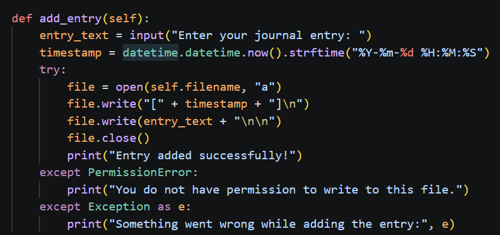
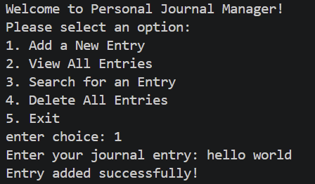
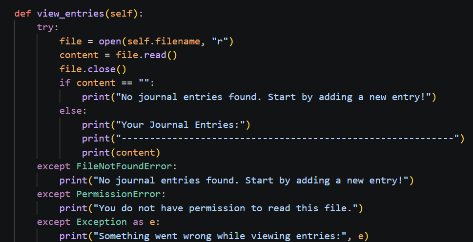
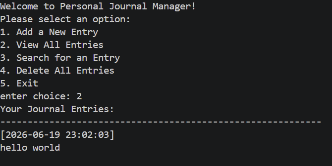
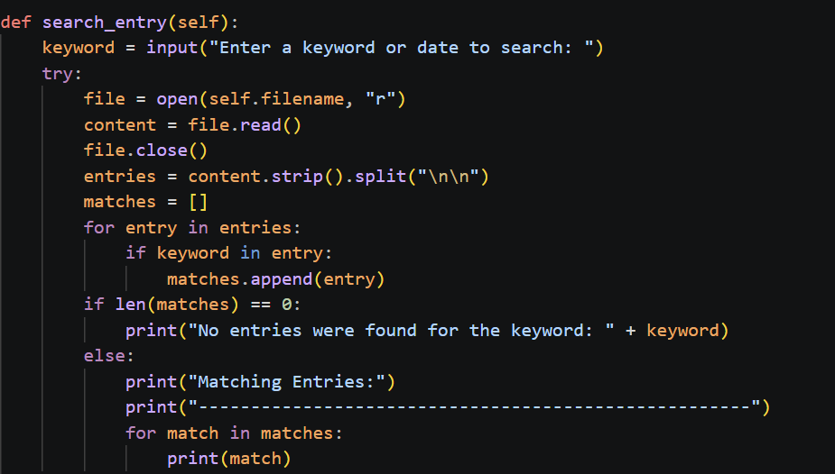
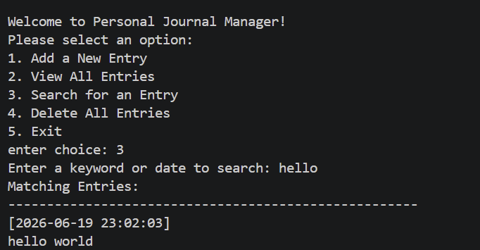
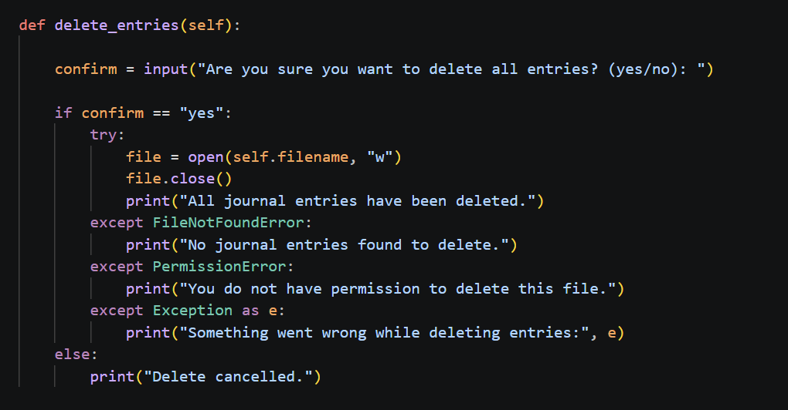
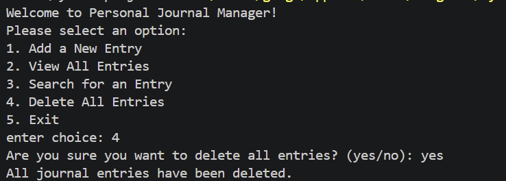

<div align="center">

# -- ! Personal Journal Manager ! --
### *Interactive Console-Based Journaling Application with File Persistence*

[](https://www.python.org/)
[](https://www.python.org/)
[](https://www.python.org/)
[](https://www.python.org/)

<br/>

> *"A journal is a conversation with yourself — this one just happens to be saved to disk."*

</div>

---

## 📋 Table of Contents

- [📌 Overview](#-overview)
- [🎯 Problem Statement](#-problem-statement)
- [✨ Key Features](#-key-features)
- [🏗️ Project Structure](#️-project-structure)
- [🔄 Project Workflow](#-project-workflow)
- [📝 Part A — Core Operations](#-part-a--core-operations)
- [🔍 Part B — Search & Maintenance](#-part-b--search--maintenance)
- [🛠️ Tech Stack](#️-tech-stack)
- [📈 Results & Insights](#-results--insights)
- [🏆 Advantages](#-advantages)
- [📄 License](#-license)
- [👤 Author](#-author)
- [🙏 Acknowledgements](#-acknowledgements)

---

## 📌 Overview

The **Personal Journal Manager** is a beginner-friendly, interactive Python console application that demonstrates core programming concepts such as **object-oriented design**, **file I/O**, **exception handling**, and **menu-driven program flow**. The program presents a continuous menu interface that lets users add, view, search, and delete journal entries, all persisted to a local text file.

This project is designed to:
- Strengthen understanding of file read/write operations in Python
- Practice exception handling with specific and generic error cases
- Apply object-oriented principles by encapsulating logic inside a class
- Provide a simple, dependency-free way to keep a personal text journal

---

## 🎯 Problem Statement

> **Objective:** Build a console-based interactive tool to create, view, search, and manage personal journal entries.

You are building a simple personal journaling utility. The program must accept user choices from a menu and execute the corresponding task — adding a timestamped entry, displaying all saved entries, searching entries by keyword, or wiping the journal clean — while gracefully handling file and permission errors along the way.

| 📂 Feature | 📄 Type | 🔍 Description |
|------------|---------|----------------|
| Add Entry | File Write | Appends a timestamped entry to the journal file |
| View Entries | File Read | Displays the full contents of the journal file |
| Search Entry | Text Search | Filters entries containing a keyword or date |
| Delete Entries | File Truncate | Clears all saved journal entries after confirmation |

The goal is to demonstrate **fundamental Python programming skills** — classes, file handling, and control flow — through a clean, menu-driven interactive program.

---

## ✨ Key Features

| Feature | Description |
|--------|-------------|
| 🔁 **Infinite Menu Loop** | Program runs continuously until user selects Exit |
| 🕒 **Automatic Timestamping** | Every entry is tagged with the current date and time |
| 📂 **Persistent Storage** | Entries are saved to and read from `journal.txt` |
| 🔍 **Keyword Search** | Finds entries matching a keyword or date string |
| 🗑️ **Confirm-Before-Delete** | Requires explicit `yes` confirmation before wiping entries |
| 🛡️ **Layered Exception Handling** | Catches `FileNotFoundError`, `PermissionError`, and generic exceptions separately |
| 🧩 **Object-Oriented Design** | All journal logic is encapsulated in a `JournalManager` class |
| 🖥️ **Structural Pattern Matching** | Uses Python's `match-case` for clean menu routing |

---

## 🏗️ Project Structure

```
📦 personal-journal-manager/
│
├── 📄 journal_manager.py    ← Main Python script (entry point)
│
├── 📄 journal.txt           ← Auto-generated journal data file
│
└── 📄 README.md             ← Project documentation
```

---

## 🔄 Project Workflow

```
Program Start
      │
      ▼
┌─────────────────────────────┐
│   Display Main Menu         │  ← Options: Add / View / Search / Delete / Exit
└────────────┬────────────────┘
             │
   ┌───────┬─┴───┬─────────┐
   ▼        ▼     ▼         ▼
┌───────┐ ┌─────┐ ┌────────┐ ┌────────┐
│Choice:│ │Choice│ │Choice: │ │Choice: │
│  1    │ │  2   │ │  3     │ │  4     │
│ (Add) │ │(View)│ │(Search)│ │(Delete)│
└───┬───┘ └──┬───┘ └───┬────┘ └───┬────┘
    │        │         │          │
    ▼        ▼         ▼          ▼
┌─────────────────────────────────────┐
│   Perform File Operation / Print    │
└────────────────┬────────────────────┘
                 │
                 ▼
         Loop Back to Menu
                 │
          (Choice: 5) Exit ✅
```

---

## 📝 Part A — Core Operations

### 1. What is the Journal Manager?

The `JournalManager` class wraps all file-based journal operations behind a simple interface. Each entry written to disk is automatically timestamped, so the journal file doubles as a chronological log.

---

### 2. Add a New Entry

> Prompts for entry text, timestamps it, and appends it to the journal file.

**Logic:**


**Sample Output:**
``


```

---

### 3. View All Entries

> Reads the entire journal file and prints its contents, or a friendly message if it's empty.

**Logic:**
``

``

**Sample Output:**
```


```

---

## 🔍 Part B — Search & Maintenance

### 4. Search for an Entry

> Splits the journal into individual entries and filters those containing a given keyword or date.

**Logic:**
``

```

**Key Concepts Used:**

| Concept | Detail |
|---------|--------|
| ✂️ `str.split("\n\n")` | Separates the file into individual entry blocks |
| 🔎 `in` Operator | Checks for keyword/date substring matches |
| 📋 List Accumulation | Collects all matching entries before printing |

**Sample Output (search = "loops"):**
``

```

---

### 5. Delete All Entries

> Requires explicit confirmation before truncating the journal file.

**Logic:**
``


```

**Sample Output:**
```


---

## 🛠️ Tech Stack

| Tool | Version | Purpose |
|------|---------|---------|
| 🐍 **Python** | 3.10+ | Core programming language (uses `match-case`) |
| 📂 **File I/O** | Built-in | Reading, appending, and truncating `journal.txt` |
| 🕒 **datetime module** | Built-in | Generating entry timestamps |
| 🛡️ **try/except** | Built-in | Handling `FileNotFoundError`, `PermissionError`, generic errors |
| 🔂 **while loop** | Built-in | Persistent menu loop control |
| 🖨️ **print() / input()** | Built-in | Console I/O and user interaction |

---

## 📈 Results & Insights

After running the program, the following outputs are produced:

- ✅ **Timestamped Entries** — Every entry is tagged with the exact date and time it was written
- 📂 **Persistent Journal File** — Entries survive across program runs via `journal.txt`
- 🔍 **Flexible Search** — Keyword or date-based lookup across all saved entries
- 🔁 **Persistent Menu** — Program loops back after every task until manually exited
- ⚠️ **Error Feedback** — Missing files, permission issues, and unexpected errors are caught and reported clearly

---

## 🏆 Advantages

| Advantage | Detail |
|-----------|--------|
| 🎓 **Beginner Friendly** | Core concepts: classes, file I/O, and exception handling in one project |
| 🔄 **Reusability** | `JournalManager` can be imported and reused in other scripts |
| 📚 **Educational** | Demonstrates layered exception handling with specific and generic catches |
| 🖥️ **No Dependencies** | Runs with pure Python — no external libraries needed |
| ⚡ **Lightweight** | Single-file script, instantly runnable from any terminal |
| 🧪 **Extensible** | Easy to add features like entry editing, tagging, or export to PDF |
| 📖 **Readable Code** | Clear method-per-feature structure makes logic easy to follow |
| 🛡️ **Input Safety** | Delete operation requires explicit confirmation to prevent accidental data loss |

---

## 📄 License

This project is licensed under the **MIT License** — see the [LICENSE](LICENSE) file for full details.

```
MIT License — Free to use, modify, and distribute with attribution.
```

---

## 👤 Author

<div align="center">

### Gangani Krishna

[]

> *"Every entry starts with a single word — just like every program starts with a single line."*

**🎓 Role:** Python Developer | Programming Enthusiast \
**📍 Location:** India\
**🛠️ Skills:** Python · File Handling · OOP · CLI Applications · Exception Handling

</div>

---

## 🙏 Acknowledgements

Special thanks to the following resources and communities that made this project possible:

- 📚 [Python Official Docs](https://docs.python.org/3/) — Official Python language reference
- 📂 [Real Python — File I/O](https://realpython.com/read-write-files-python/) — In-depth file handling tutorials
- 🛡️ [Python Docs — Exceptions](https://docs.python.org/3/tutorial/errors.html) — Exception handling reference
- 🖥️ [W3Schools Python](https://www.w3schools.com/python/) — Beginner Python reference
- 🧮 [Python f-strings Guide](https://realpython.com/python-f-strings/) — Formatted string literals
- 💬 [Stack Overflow Community](https://stackoverflow.com/) — Problem-solving support
- 📖 [Kaggle Learn](https://www.kaggle.com/learn) — Python and programming courses

---

<div align="center">

---

*Made with ❤️ and ☕ — Last updated: 19 June, 2026*

</div>