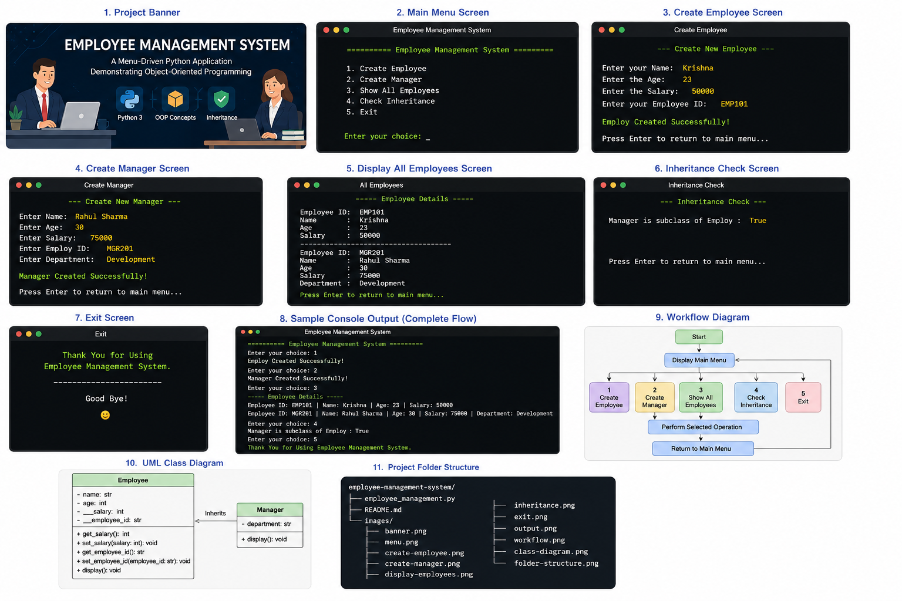
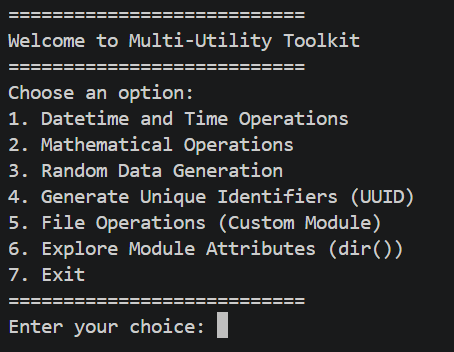
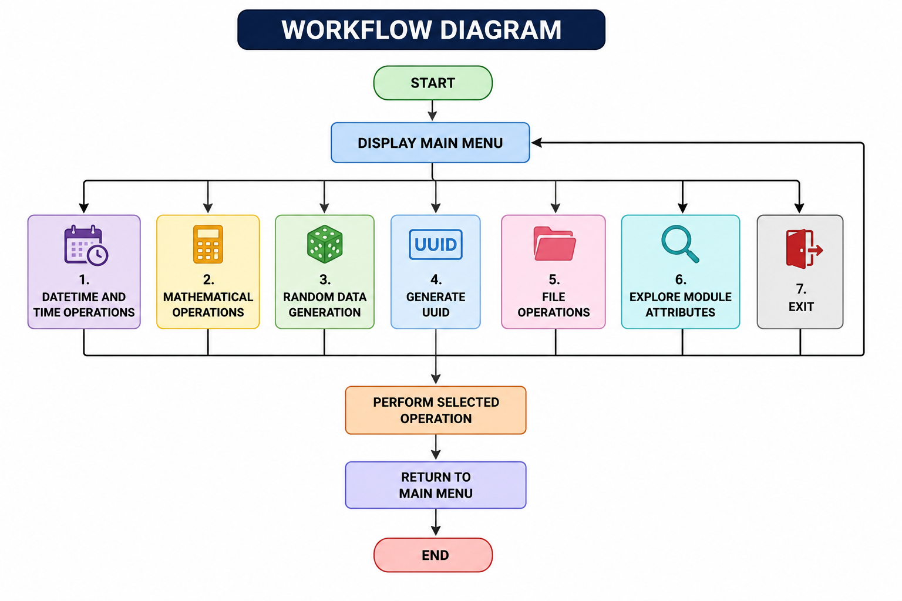
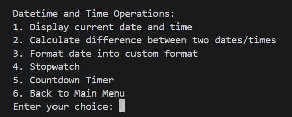
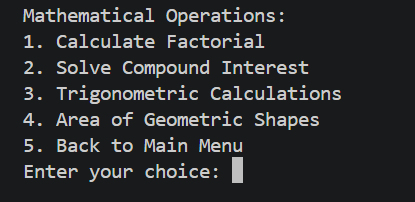
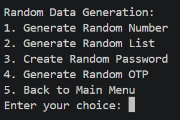
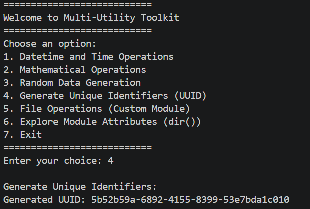
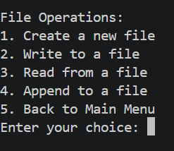
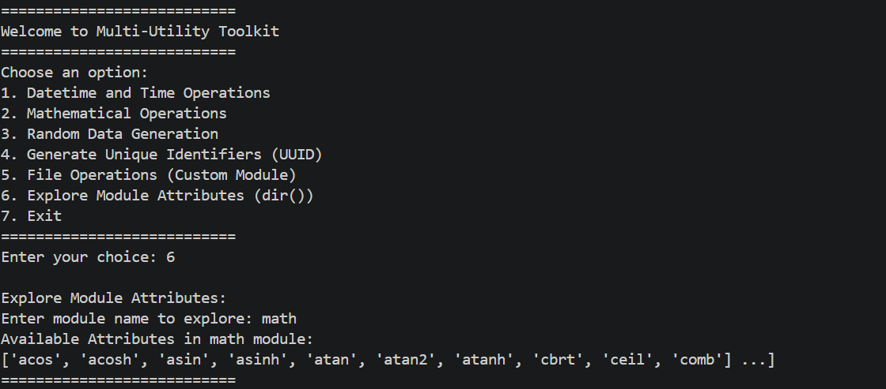

<div align="center">

# 🛠️ Multi-Utility Toolkit

### *A Modular Python Console Application Demonstrating Standard Library Modules, Custom Modules, and Menu-Driven Programming*

<p align="center">

</p>

[](https://www.python.org/)
[](https://docs.python.org/3/library/)
[](https://www.python.org/)
[]()

> **"Learn Python modules through one interactive toolkit."**

</div>

---

# 📋 Table of Contents

- 📌 Overview
- 🎯 Objective
- ✨ Features
- 📂 Project Structure
- 📸 Application Preview
- 🔄 Workflow
- 📦 Modules Included
- 📅 Datetime Operations
- ➗ Mathematical Operations
- 🎲 Random Data Generation
- 🆔 UUID Generator
- 📁 File Operations
- 🔍 Module Exploration
- 🛠️ Technologies Used
- 📊 Screenshots
- 🚀 Future Improvements
- 🏆 Advantages
- 📄 License
- 👤 Author
- 🙏 Acknowledgements

---

# 📌 Overview

The **Multi-Utility Toolkit** is a modular Python console application that demonstrates the usage of Python's standard libraries along with custom modules. The project is organized into separate files, making it easy to understand modular programming and code reusability.

---

## 📸 Overview Screenshot

<p align="center">

</p>

---

# 🎯 Objective

Develop a menu-driven toolkit that combines multiple utilities into a single application while demonstrating:

- Modular Programming
- Custom Python Modules
- Standard Library Modules
- File Handling
- Date & Time Operations
- Mathematical Functions
- Random Data Generation
- UUID Generation
- Module Introspection

---

# ✨ Features

| Feature | Description |
|----------|-------------|
| 📅 Datetime Operations | Work with current date and time |
| ➗ Math Operations | Perform mathematical calculations |
| 🎲 Random Generator | Generate random values |
| 🆔 UUID Generator | Generate unique identifiers |
| 📁 File Operations | Read/write files using custom modules |
| 🔍 Explore Modules | View module attributes using `dir()` |
| 📦 Modular Design | Separate files for each utility |
| 🖥️ Interactive CLI | User-friendly menu-driven interface |

---

# 📂 Project Structure

```text
📦 project-7/
│
├── main.py
├── datetime_ops.py
├── math_ops.py
├── random_ops.py
├── uuid_ops.py
├── file_menu.py
├── explore_ops.py
│
├── custom_modules/
│   ├── file_ops.py
│   ├── math_utils.py
│   └── __init__.py
│
├── images/
│   ├── banner.png
│   ├── menu.png
│   ├── datetime.png
│   ├── math.png
│   ├── random.png
│   ├── uuid.png
│   ├── file.png
│   ├── explore.png
│   ├── workflow.png
│   └── output.png
│
└── README.md
```

---

# 📸 Main Menu

<p align="center">

</p>

---

# 🔄 Workflow

```text
               Start
                 │
                 ▼
        Display Main Menu
                 │
 ┌───────┬────────┬────────┬────────┬────────┬────────┐
 ▼       ▼        ▼        ▼        ▼        ▼
Datetime Math   Random   UUID    File   Explore
                 │
                 ▼
          Execute Selected Module
                 │
                 ▼
           Return to Main Menu
                 │
                 ▼
                Exit
```

---

## 📸 Workflow Diagram

<p align="center">

</p>

---

# 📦 Modules Included

| Module | Purpose |
|----------|---------|
| `datetime_ops.py` | Date and Time operations |
| `math_ops.py` | Mathematical calculations |
| `random_ops.py` | Random number generation |
| `uuid_ops.py` | UUID generation |
| `file_menu.py` | File operation menu |
| `explore_ops.py` | Explore module attributes |
| `custom_modules/file_ops.py` | Custom file utilities |
| `custom_modules/math_utils.py` | Custom math utilities |

---

# 📅 Datetime Operations

Features include:

- Current Date
- Current Time
- Formatting Date & Time

### Screenshot

<p align="center">

</p>

---

# ➗ Mathematical Operations

Supports various mathematical calculations using Python's `math` module and custom functions.

### Screenshot

<p align="center">

</p>

---

# 🎲 Random Data Generation

Generate random:

- Numbers
- Choices
- Lists
- Values

### Screenshot

<p align="center">

</p>

---

# 🆔 UUID Generator

Generate universally unique identifiers.

### Screenshot

<p align="center">

</p>

---

# 📁 File Operations

Implemented using a custom module.

Capabilities may include:

- Read Files
- Write Files
- Append Data

### Screenshot

<p align="center">

</p>

---

# 🔍 Explore Module Attributes

Uses

```python
dir()
```

to inspect module contents.

### Screenshot

<p align="center">

</p>

---

# 🛠️ Technologies Used

| Technology | Purpose |
|------------|---------|
| 🐍 Python 3.10+ | Programming Language |
| 📅 datetime | Date & Time |
| ➗ math | Mathematical Functions |
| 🎲 random | Random Data |
| 🆔 uuid | Unique Identifiers |
| 📁 File Handling | Read & Write Files |
| 📦 Custom Modules | Reusable Components |
| 🖥️ CLI | Console Interface |

---

# 📊 Sample Output

```text
===========================
Welcome to Multi-Utility Toolkit
===========================

1. Datetime and Time Operations
2. Mathematical Operations
3. Random Data Generation
4. Generate UUID
5. File Operations
6. Explore Module Attributes
7. Exit
```

---


---

# 🚀 Future Improvements

- 🌐 GUI Version using Tkinter
- 🌍 Flask Web Application
- 💾 Database Integration
- 📊 Charts & Graphs
- 📂 File Explorer
- 🔐 User Authentication
- 📝 Logging System
- 📦 Package Distribution via pip

---

# 🏆 Advantages

- Beginner Friendly
- Demonstrates Modular Programming
- Covers Multiple Standard Library Modules
- Easy to Extend
- Clean Project Structure
- Reusable Custom Modules
- Lightweight & Fast

---

# 📄 License

```text
MIT License

Free to use, modify, and distribute.
```

---

# 👤 Author

<div align="center">

## Gangani Krishna

🐍 Python Developer

🎓 Computer Engineering Student

💻 Passionate about Python, Modular Programming, and Software Development

> *"Build once, reuse everywhere with modular programming."*

</div>

---

# 🙏 Acknowledgements

Special thanks to:

- 📘 Python Official Documentation
- 💻 Real Python
- 📚 GeeksforGeeks
- 🧠 Stack Overflow
- 🎓 Python Community

---

<div align="center">

## ⭐ Multi-Utility Toolkit

**Made with ❤️ using Python**

</div>